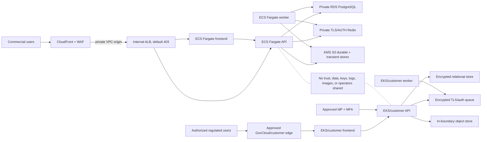

# ProofShape dual production architecture

Status: implementation baseline, not live evidence

ProofShape has two isolated deployment planes. The commercial plane is AWS
commercial ECS/Fargate. The regulated plane is a future approved AWS GovCloud
or customer-controlled Kubernetes boundary. Neither plane authorizes or shares
data with the other.

This architecture does not claim ITAR, CMMC, FedRAMP, NIST 800-171, SOC 2, or
customer authorization.

## 1. System overview

## 2. Technology choices

| Layer | Commercial SaaS | Regulated | Reason |
|---|---|---|---|
| Public edge | CloudFront; WAF and custom TLS required for production/HA | Approved GovCloud/customer ingress and TLS | One reviewed public origin per plane |
| Origin | Internal ALB through CloudFront VPC origin | Private load balancer/ingress | No raw origin release URL |
| Frontend/API/worker | Existing immutable Next.js, FastAPI, and ARQ images on ECS Fargate | Same reviewed application images copied into the approved EKS/customer registry | One application code line, separate supply chains and boundaries |
| Database | Private encrypted RDS PostgreSQL with backups/PITR | Approved encrypted RDS/customer PostgreSQL, normally Multi-AZ | Durable relational state and tested recovery |
| Queue/cache | Private ElastiCache Redis with TLS, AUTH, and environment isolation | Approved in-boundary Redis with TLS/auth/replication | Jobs, sessions, rate limits, magic links, and health depend on it |
| Customer objects | Separate KMS S3 durable/versioned and transient/unversioned buckets | Approved KMS/versioned in-boundary object store with contract retention | Durable evidence and deletable incoming uploads have different truth contracts |
| Secrets | AWS Secrets Manager metadata plus out-of-band values | In-boundary secret manager/external secrets | No secret value in Git, images, Terraform variables, or state |
| Identity | Email-first magic link, optional initial password, Turnstile; enterprise SSO when approved | Protected baseline is SAML to an approved MFA IdP plus SCIM | Central revocation and environment-specific policy |
| Telemetry | CloudWatch plus approved Sentry/uptime/alert delivery | In-boundary logs, metrics, traces, SIEM, and paging | Regulated data must not leave its boundary |
| Delivery | Exact-repository/environment GitHub OIDC to isolated ECR/ECS | Approved signed-image and runner path into GovCloud/customer registry and Helm | No direct developer-to-production deployment |

Fly configuration remains in the repository only as legacy/non-release
material. It is not the ProofShape commercial architecture and is not called by
the canonical AWS workflow.

## 3. Commercial staging and production isolation

Staging and production use distinct:

- Terraform state buckets/keys and AWS account boundaries when available;
- VPCs, CIDRs, CloudFront distributions, ALBs, certificates, and WAF/logging;
- ECS clusters, services, task definitions, ECR repositories, and OIDC roles;
- RDS databases, Redis replication groups/AUTH secrets, S3 buckets/KMS keys;
- runtime secrets, email/Turnstile/Sentry projects, alarms, and approvals; and
- retained deployment and acceptance evidence.

The AWS workflow fingerprints the account/cluster and account/region/ECR
publication boundary. Production refuses the staging boundary and refuses image
digests that do not match the staged artifact bytes.

## 4. Data and tenant isolation

- Every plane has independent organizations, memberships, sessions, API keys,
  connector credentials, analyses, cost decisions, audit events, and objects.
- No database replication, shared Redis, shared S3 bucket/key, shared Sentry
  project containing customer context, cross-plane analytics, or shared support
  session is permitted.
- Application `org_id` authorization remains mandatory. Infrastructure
  isolation adds a boundary; it does not replace tenant predicates.
- CAD bytes, quote details, bearer tokens, and customer identifiers are
  prohibited from logs, traces, resource names, support tickets, and CI
  artifacts.
- Retention, deletion, legal hold, backup, and restore rules are set by data
  class and contract. Durable evidence and transient uploads must not be
  configured as one lifecycle class.

## 5. Commercial ingress and auth-proxy contract

CloudFront is the canonical HTTPS origin. Dynamic routes forward the cookies,
query strings, headers, and methods required by Next.js, auth, API, upload,
share, SCIM, and health traffic. Only immutable `/_next/static/*` assets use the
optimized cache policy.

CloudFront adds `CloudFront-Viewer-Address`. The frontend runs with
`AUTH_PROXY_CLIENT_IP_SOURCE=cloudfront`, validates the single address-and-port
form, and signs the resulting IP, method, backend path, and timestamp with the
environment's `AUTH_PROXY_SECRET`. It never treats the ALB
`X-Forwarded-For` chain as authenticated viewer identity. The API verifies that
signature before session-returning auth operations.

The ALB is internal, its security group accepts only the account/VPC
CloudFront-origin service group, and its listeners default to fixed 403. The raw
ALB hostname is never a release URL.

Staging may use the generated CloudFront HTTPS hostname with a private HTTP
origin hop. Production/HA requires a custom alias, TLS 1.2 viewer and origin
certificates, WAF/logging, canonical Host enforcement, and ALB deletion
protection.

## 6. API exposure contract

| Surface | Route | Authentication | Exposure |
|---|---|---|---|
| Browser application | `/` and app routes | Dashboard session | CloudFront to frontend |
| Public share | `/s/*` | Sanitized public read | CloudFront to frontend; backend data fetched privately |
| Auth | same-origin frontend routes plus backend `/auth/*` | Public initiation, signed server proxy/callback | CloudFront; no raw origin bypass |
| Product API | `/api/v1/*` | Session or scoped API key plus org authorization | Same-origin proxy/direct reviewed API paths |
| Liveness | `/health` | Minimal unauthenticated status | CloudFront monitor path |
| Deep health | `/health/deep` | Dedicated monitor token | Protected deploy/monitor use |
| Metrics | `/metrics` | Disabled publicly or restricted internally | Never an open release endpoint |

The frontend receives `API_BASE` and `API_ORIGIN` at runtime from Terraform's
canonical CloudFront origin. No environment hostname is compiled into the
application source.

## 7. Build and promotion contract

CI and deployment have separate jobs:

1. `.github/workflows/ci.yml` runs application, browser, migration, restore,
   static analysis, dependency, image build/scan, SBOM, Compose, and Helm proof.
   It neither publishes to a cloud registry nor deploys.
2. `AWS Commercial Promotion` checks a reviewed exact SHA and requires a
   successful exact-SHA CI run.
3. It builds backend/frontend archives once, hashes them, and uploads one
   inter-job artifact.
4. Staging publishes those bytes to its ECR boundary.
5. Production downloads the same artifact, publishes it into its distinct ECR
   boundary, and verifies both ECR digests match staging.
6. Promotion runs a one-shot migration, registers digest-qualified revisions,
   rolls API/worker/frontend, waits stable, executes authenticated CloudFront
   health, and rolls updated services back on failure.

Publish-only modes solve first-service bootstrap. Promotion modes require
already-created services with positive desired counts. No production rebuild or
caller-supplied digest is allowed.

## 8. Security controls

- TLS is required at the public edge and for database/Redis/SaaS connections;
  production also requires TLS from CloudFront to the ALB.
- ECR tags are immutable, scanning is enabled, and workload images are selected
  by digest.
- Containers are non-root with read-only root filesystems and only explicit
  writable scratch/cache mounts.
- Runtime roles are component-specific. Frontend and migration do not inherit
  customer-object access.
- RDS, Redis, S3, logs, and backups are encrypted. Regulated keys never enter
  commercial AWS.
- Audit/security logs are retained in access-controlled stores. Browser replay
  is disabled and telemetry is scrubbed.
- Vulnerability, SBOM, migration, tenant, auth, browser, restore, rollback, and
  live dependency evidence gate release.

## 9. Availability and cost profiles

| Control | Budget staging | HA/production |
|---|---|---|
| Frontend/API/worker | One task each may be used honestly | At least two tasks each |
| RDS | Single-AZ allowed | Multi-AZ, PITR, deletion protection, final snapshot |
| Redis | One node, no failover | At least two nodes with automatic failover |
| WAF/edge logs | Optional only for budget staging | Required and retained |
| Origin TLS | Private HTTP allowed | HTTPS/TLS 1.2 required |
| Autoscaling | May be disabled | Enabled with floor two |

Two subnets do not make one task or one database copy highly available. The
actual profile must be reported, not inferred from the presence of IaC.

## 10. Test and operations strategy

1. Unit/type/lint, migration, dependency, and static-security gates.
2. Real Postgres/Redis integration and tenant/role tests.
3. Human-simulated browser journeys with exact visual, persisted, numerical,
   artifact, failure, recovery, and mobile outcomes.
4. Representative supported CAD and production-size multipart S3 paths.
5. Staging email, Turnstile, Sentry, alarm, restore, interruption, kill-switch,
   rollback, load, and soak evidence.
6. Exact staged-digest production promotion and production smoke.
7. Independent security/legal/customer authorization appropriate to the plane.

Engineering targets such as RPO/RTO are not evidence until measured by a drill.

## 11. Human gates

The owner must supply or approve:

- ProofShape AWS accounts, billing, region, budget alerts, and GitHub OIDC
  bootstrap access;
- email, Turnstile, Sentry/alert, domain, DNS, and certificate resources;
- customer-relevant CAD/cost acceptance evidence;
- ProofShape name/IP, privacy/terms, and commercial launch approval; and
- for regulated work only, the eligible landing zone, classification, contract
  scope, assessor/counsel decision, and authorized operators.

Until those inputs and the applicable acceptance evidence exist, the truthful
state is architecture implemented, not production-live.
