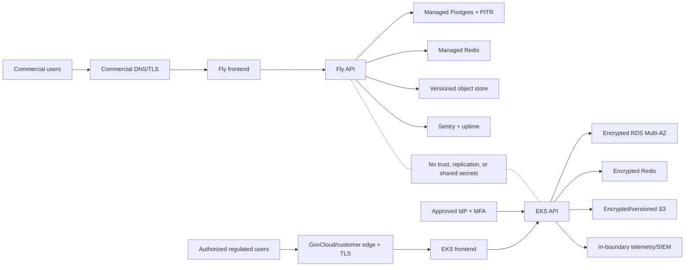

# CadVerify Dual Production Architecture

Status: implementation baseline. This document defines two isolated production
planes; it does not claim ITAR, CMMC, SOC 2, or customer certification.

## 1. System overview

CadVerify ships as two separately operated products:

1. **Commercial SaaS** for ordinary customer data. Fly.io runs the application;
   managed Postgres, Redis, S3-compatible storage, email, and observability are
   mandatory production dependencies.
2. **Regulated** for CUI and unclassified ITAR-controlled technical data. The
   preferred hosted target is a dedicated AWS GovCloud (US) account and EKS
   cluster. A customer-controlled on-prem Kubernetes cluster uses the same Helm
   contract. No data, identities, keys, logs, backups, images, support tooling,
   or administrators cross between the two planes.

## 2. Technology choices

| Layer | Commercial SaaS | Regulated | Reason |
|---|---|---|---|
| Frontend/API/worker | Existing Next.js, FastAPI, arq images on Fly | Same immutable images on EKS/on-prem Kubernetes | One application code line, separate deployment boundaries |
| Database | Managed Postgres with pooled/direct URLs and PITR | RDS PostgreSQL Multi-AZ encrypted with a customer-managed KMS key | Durable relational state and auditable restore controls |
| Queue/cache | Managed TLS Redis | ElastiCache/approved Redis with TLS, auth, replication, and encrypted snapshots | Required for rate limits, jobs, magic links, and worker health |
| CAD/object data | S3-compatible bucket with versioning | GovCloud S3 or approved on-prem S3 with versioning, KMS, lifecycle, and access logging | Shared local volumes are not a production data-safety boundary |
| Secrets | Fly/GitHub secret stores | AWS Secrets Manager + External Secrets, or customer-approved equivalent | No secrets in Helm values, Git, images, or CI output |
| Identity | Password + magic link; MFA roadmap or enterprise SSO | Current protected baseline: SAML to an approved IdP with MFA plus SCIM lifecycle; OIDC requires a separate reviewed release overlay | Regulated access must be centrally governed and revocable |
| Telemetry | Sentry plus external uptime monitoring | In-boundary OpenTelemetry, logs, metrics, SIEM, and paging | Regulated data must not leak through telemetry |
| Delivery | Reviewed `main` promotion to Fly | Signed immutable images promoted into GovCloud/customer registry, then Helm | No direct developer-to-production deploy |

AWS GovCloud is the opinionated hosted regulated target because AWS documents
US-only regions, restricted AWS personnel access, and support for ITAR/CUI
workloads. That infrastructure support does not make CadVerify or its operator
compliant by itself; the shared-responsibility controls below still apply.

## 3. Data and isolation model

- Every plane has independent organizations, memberships, sessions, API keys,
  connector credentials, analyses, cost decisions, audit events, and blobs.
- No database replication, shared Redis, shared object-store bucket, cross-plane
  analytics, shared Sentry project, or shared support session is permitted.
- Organization isolation remains enforced by existing `org_id`/membership
  authorization. Infrastructure isolation is an additional boundary, not a
  replacement for application authorization.
- Regulated object keys and backups are encrypted with customer-managed keys;
  key administrators and data administrators are separate roles.
- Retention, legal hold, deletion, and backup policies are configured per data
  class and contract. CAD content is prohibited from logs, traces, resource
  names, support tickets, and CI artifacts.

## 4. API and ingress contracts

The application API does not fork between planes:

| Surface | Route | Authentication | Exposure |
|---|---|---|---|
| Browser application | `/` | Session required for app routes | Frontend ingress |
| Public share pages | `/s/*` | Public, sanitized, noindex | Frontend ingress |
| Auth | `/auth/*` | Public initiation; signed/validated callback | API ingress |
| Product API | `/api/v1/*` | Dashboard session or scoped API key; org authorization | API ingress |
| Liveness | `/health` | Unauthenticated, minimal dependency status | Monitor/ingress |
| Deep readiness | `/health/deep` | Production monitor token plus network restriction where available | Deploy gate/internal monitor |
| Metrics | `/metrics` | Restrict to telemetry network/service account | Internal only |

The Next.js server uses the runtime backend Service URL. Browser product calls
remain same-origin through the streaming `/api/proxy/*` route; public share
reads use a narrow GET-only same-origin proxy. Backend origins are not compiled
into the frontend image, so the same digest is promoted across environments.
On the single-host regulated ingress, `/s/*` therefore stays on Next; Next reads
the backend's sanitized `/s/*` JSON over the private Service URL.
Public login/signup/magic requests also stay same-origin. The web server signs
the ingress-observed client IP, request method, API path, and short-lived
timestamp with a dedicated per-environment `AUTH_PROXY_SECRET`; the API rejects
spoofed forwarding data and otherwise falls back to its direct socket peer.

## 5. Authentication and authorization

### Commercial

- Password plus magic link, Turnstile, generic auth errors, Redis-backed rate
  limits, secure HTTP-only cookies, and server-side session revocation.
- Released session validation fails closed when authoritative database-backed
  activation or revocation state is unavailable.
- New commercial accounts prove email ownership by magic link before receiving
  a first-party session. They may then add a password once; public unverified
  password signup is fail-closed in released environments.
- Email links carry the one-time bearer in a URL fragment and require an
  explicit continue action, reducing query-log/referrer leakage and accidental
  consumption by basic mail scanners. Session exchange is server-to-server.
- Production magic-link tokens and session keys are unique to production.
- Admin operations remain organization-scoped; superadmin access is separately
  logged and limited.

### Regulated

- The approved release baseline uses SAML; MFA is enforced by the approved IdP.
- Released SAML environments disable the password login/signup/setup handlers
  and forms, disable magic link, and render the real same-origin IdP initiation
  path. OIDC code is present but is not part of this approved deployment packet.
- Signed SAML messages/assertions, issuer/audience/recipient/time/replay
  validation, and certificate/JWKS rotation are mandatory. Production SAML
  login and SP-initiated logout responses are bound to one-time Redis-backed
  request IDs/RelayState before a session is issued or cleared.
- SCIM deactivation revokes sessions and organization access. Password login is
  disabled except for documented, monitored break-glass accounts.
- Human and machine identities use least privilege. Production administrators
  must satisfy the applicable U.S.-person/export authorization policy.

## 6. Security model

- TLS is required at every network hop. Database and Redis URLs must use TLS.
- Production images use immutable SHA tags/digests, non-root users, read-only
  root filesystems, dropped capabilities, RuntimeDefault seccomp, and no service
  account token unless explicitly needed.
- Regulated Kubernetes starts deny-all and opens only approved ingress and
  egress destinations. Public internet egress from CAD-processing pods is not
  permitted unless explicitly documented and approved.
- S3, database, cache snapshots, logs, and backups are encrypted. Regulated keys
  remain in the regulated boundary.
- Secrets are externally managed and rotated; static cloud keys are avoided in
  EKS through workload identity/Pod Identity.
- Audit and security logs are exported to an append-resistant, access-controlled
  store with retention matching policy.
- Vulnerability scans, SBOMs, image signatures, dependency review, tenant tests,
  and a launch security review gate every promotion.
- ITAR/export-control classification and authorization are legal/compliance
  decisions. CUI contracts additionally drive NIST SP 800-171/CMMC scope.
- Regulated startup overrides external Sentry, remote reconstruction, password,
  and magic-link settings even if a stale runtime Secret contains them. The
  actual TLS ingress, not only a port-forward, must pass the auth-proxy handshake.

## 7. Caching and queues

| Item | Location | Lifetime | Invalidation |
|---|---|---|---|
| Rate limits and signup controls | Redis | Existing rolling windows | Key expiry/config change |
| Magic-link token state | Redis | Token expiry | Consume/revoke/expiry |
| arq queue and worker heartbeat | Redis | Queue lifecycle/short heartbeat TTL | Worker completion/expiry |
| Application DB connections | SQLAlchemy pool | Recycle defaults to 300 seconds | Process restart/pool recycle |
| Frontend build assets | Immutable image/CDN edge | Release lifetime | New SHA release |
| CAD/object content | S3 | Contract retention/lifecycle | Authorized deletion/lifecycle rule |

No cache is shared between commercial and regulated environments.

## 8. Scalability and availability

- Commercial baseline: two API machines, two workers, two always-on frontend
  machines, managed database/cache, and admission control. Add API
  machines before increasing per-machine analysis concurrency.
- Regulated baseline: at least two frontend, API, and worker replicas distributed
  across availability zones, PodDisruptionBudgets, backend/frontend HPAs, and
  queue-aware worker scaling after a KEDA design review.
- Keep `MAX_CONCURRENT_ANALYSES` below database pool capacity per replica and
  total pools below provider connection limits.
- RPO/RTO are contractual inputs. Initial engineering targets are RPO <= 15
  minutes and RTO <= 4 hours, validated by restore and failover drills rather
  than assumed from provider features.

## 9. Testing strategy

1. Unit/type/lint and migration tests on every change.
2. Real Postgres/Redis integration tests and tenant isolation tests.
3. Image build, SBOM, vulnerability, secret, and configuration scans.
4. Helm lint/render plus policy validation for regulated overlays.
5. Staging auth, email/IdP, STEP upload, cost, queue, object-store, and rollback
   tests with production-like dependencies.
6. Load and soak tests with realistic CAD corpus and organization concurrency.
7. Backup restore and regional/account recovery drills with measured RPO/RTO.
8. Independent penetration test and applicable CMMC/contract assessment before
   regulated customer authorization.

## 10. Build and rollout order

1. Resolve the canonical Git branch/PR and protect `main`.
2. Bring commercial staging to the new mandatory gates.
3. Provision commercial production dependencies and complete its launch audit.
4. Create the GovCloud/customer regulated landing zone and personnel boundary.
5. Build/sign/copy immutable images inside the regulated supply chain.
6. Create external runtime/SAML secrets and private production values.
7. Deploy regulated staging; complete IdP, SCIM, object-store, DR, load, and
   security evidence.
8. Obtain counsel/assessor/customer authorization.
9. Promote the identical signed digests to regulated production.
10. Operate the planes with separate on-call, access reviews, and evidence.

## 11. Handoffs and human gates

- **UX:** no regulated data in analytics/session replay; clear environment and
  classification banners.
- **Fullstack:** keep auth, org isolation, retention, and audit behavior identical
  across deployment targets; no cloud-specific bypasses.
- **QA:** own the two-environment release matrix and negative tenant/auth tests.
- **Security:** issue an exact `APPROVED`, `APPROVED WITH CONDITIONS`, or
  `BLOCKED` launch verdict per environment.
- **DevOps:** own IaC, secret contracts, signing, deployment, health, rollback,
  backup, and evidence capture.

`HITL REQUIRED`: the owner must obtain/confirm (a) a commercial custom domain,
email/S3/monitoring accounts, (b) an eligible AWS GovCloud account or named
customer-managed Kubernetes target, (c) the regulated data classification and
required CMMC level/contract clauses, and (d) authorized U.S.-person operators.
