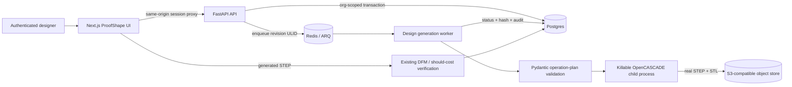

# ProofShape Design Studio integration

Status: production-safe first slice implemented on `codex/proofshape-scalecad-staging`
Decision date: 2026-07-12
Source reference: `zandemha2025/cad-conversational-app` at `7780ed1`
Deployment boundary: new non-Arcus ProofShape staging resources only

## Executive decision

ProofShape keeps CadVerify's hardened application as the system of record and
rebuilds the useful ScaleCAD workflows inside it. ScaleCAD is a capability and
interaction reference; it is not deployed wholesale and it does not become a
second application beside ProofShape.

The retained platform owns authentication, organization tenancy, RBAC,
transactional audit, Postgres, ARQ/Redis, object storage, verification, costing,
observability, and deployment gates. Design Studio adds org-scoped design
projects, immutable revisions, safe parametric generation, preview, export, and
the handoff into verification.

ScaleCAD's generated-Python execution, Supabase identity, Celery queue, startup
DDL, stub geometry, mock exports, and duplicate cost model are explicitly
excluded. A future language model may propose a typed operation plan, but no
model output is ever interpreted as source code.

## System overview



There is one user account, one organization boundary, one navigation model, and
one evidence trail. Users do not sign into or mentally switch between a CAD app
and a verification app.

## Technology choices

| Concern | ProofShape owner | Decision |
|---|---|---|
| Web application | Existing Next.js 16 / React 19 app | Add `/designs`; do not create a second Vite shell |
| API | Existing FastAPI service | Add `/api/v1/designs` routes |
| Identity and access | Existing first-party sessions/API keys + RBAC | Viewer reads; analyst creates/revises; every query resolves org |
| System of record | Existing Postgres / SQLAlchemy / Alembic | Add projects and immutable revisions in migration 0040 |
| Job queue | Existing Redis / ARQ worker | Add `design_generation` task; no Celery plane |
| CAD kernel | Existing gmsh/OpenCASCADE dependency | Deterministic, allowlisted primitives in a spawned child process |
| Binary storage | Existing local/S3 object-store abstraction | Store STEP/STL by org, project, and revision |
| Verification and cost | Existing hardened engines | Generated STEP enters the same existing file path |
| Observability | Existing request IDs, Sentry, OTEL, metrics, audit | Add stable failure codes and product audit events |

## Trust boundaries

1. The browser can submit only a discriminated operation plan (`plate`,
   `bracket`, or `enclosure` in the first slice).
2. Pydantic rejects unknown keys, unbounded values, invalid wall ratios, holes
   outside material, and excess operation counts.
3. The worker validates the persisted plan again. Database contents are not
   implicitly trusted.
4. The OpenCASCADE kernel runs in a spawned subprocess with a hard deadline.
   Timeout or crash cannot strand the API or ARQ process.
5. The child receives numeric plan data and temporary output paths. It has no
   source-code input, `eval`, `exec`, shell command, or generated module.
6. Artifacts are stored under
   `{org_ulid}/{design_ulid}/revisions/{n}/...`; the API obtains keys only after
   an org-scoped project/revision query.
7. The frontend accesses artifacts through the same-origin authenticated proxy.
   S3 locators and credentials never reach the browser.

## Data model

### `design_projects`

- `ulid`: stable public identifier
- `org_id`: mandatory tenant owner
- `created_by`: nullable actor reference (evidence survives user deletion)
- `name`: user-facing design name
- `status`: `generating | ready | failed | archived`
- `source_kind`: `template | ai_plan`; first release writes only `template`
- `current_revision`: current immutable revision number
- `created_at`, `updated_at`

### `design_revisions`

- `ulid`, `design_id`, `org_id`, `created_by`
- unique `(design_id, revision_no)`
- `status`: `queued | generating | ready | failed`
- `operation_plan_json`: the exact validated generation input
- `design_note`: optional human context; never interpreted as geometry
- `generation_engine`: currently `proofshape-occ-v1`
- `geometry_hash`: SHA-256 of the generated STEP artifact
- STEP/STL object keys and byte sizes
- measured bounding box, volume, surface-element count, and solid count
- stable error code plus a sanitized user-facing message
- lifecycle timestamps

### Existing `jobs`

`job_type=design_generation`; `params_json.revision_ulid` is the only task
pointer. A worker resolves the revision and project inside the job's org before
doing work.

## API contract

| Method | Route | Role | Result |
|---|---|---|---|
| `GET` | `/api/v1/designs` | viewer | Current non-archived projects in caller org |
| `POST` | `/api/v1/designs/interpret` | analyst | Deterministic description-to-form prefill; no AI or prompt persistence |
| `POST` | `/api/v1/designs` | analyst | `202`, project + revision + poll URL |
| `GET` | `/api/v1/designs/{id}` | viewer | Current revision or tenant-obscuring `404` |
| `POST` | `/api/v1/designs/{id}/revisions` | analyst | Immutable next revision; `409` while current generation runs |
| `GET` | `/api/v1/designs/{id}/revisions` | viewer | Complete immutable revision history |
| `GET` | `/api/v1/designs/{id}/revisions/{n}` | viewer | Exact historical revision |
| `DELETE` | `/api/v1/designs/{id}` | analyst | Archive; never hard-delete engineering evidence |
| `GET` | `/api/v1/designs/{id}/preview.stl` | viewer | Authenticated streaming STL preview |
| `GET` | `/api/v1/designs/{id}/download.step` | viewer | Authenticated streaming STEP download |
| `GET` | `/api/v1/designs/{id}/revisions/{n}/preview.stl` | viewer | Exact historical STL |
| `GET` | `/api/v1/designs/{id}/revisions/{n}/download.step` | viewer | Exact historical STEP |

Create and revise accept only this versioned shape family:

```json
{
  "name": "Motor mount",
  "design_note": "Prototype for fixture review",
  "plan": {
    "kind": "plate",
    "width_mm": 80.0,
    "depth_mm": 50.0,
    "thickness_mm": 6.0,
    "holes": [
      {"x_mm": -25.0, "y_mm": -12.0, "diameter_mm": 6.0}
    ]
  }
}
```

The API returns stable failure codes. It never returns a Python/C++ traceback,
kernel command, object-store locator, or another tenant's existence.

## User journey

1. A signed-in user opens **Design Studio** from the common navigation.
2. Empty state explains the three safe starting shapes and that dimensions are
   millimetres. There is a working example; no provider setup is required.
3. The user either describes a supported shape in explicit millimetres or
   chooses a template. Description parsing only prefills the same bounded form;
   the user reviews every value before generation.
4. The UI immediately shows `Queued`, then `Generating`, and polls the real
   revision. A failure presents a stable explanation and keeps the inputs for a
   retry.
5. A ready design shows the real STL, measured dimensions/volume, engine and
   revision provenance, not a decorative placeholder.
6. **Revise** starts from the exact current plan and creates revision N+1. The
   revision picker keeps every older preview, hash, STEP, and verify action
   available rather than silently replacing it.
7. **Download STEP** produces the exact selected revision's engineering artifact.
8. **Verify this design** opens `/verify?design={id}&revision={n}`. The Verify app fetches the
   authenticated STEP, constructs a browser `File`, and sends it through the
   same DFM/should-cost path as a user upload.
9. The existing decision, history, approval, RFQ, and audit journeys continue
   from that point; Design Studio does not fork them.

## Security and compliance controls

- Organization predicates are mandatory on list, detail, revise, archive, and
  artifact reads. Cross-tenant misses are `404`, not `403`.
- Mutation routes use existing platform RBAC, rate limits, and kill switch.
- `design.created`, `design.generation_requested`, `design.generated`,
  `design.generation_failed`, and `design.archived` are transactional audit
  events.
- Successful generation records the STEP SHA-256 in both the revision and audit
  event. The download response carries that digest and the Verify handoff
  rejects tampered or mismatched bytes before analysis.
- Binary writes are atomic locally and use the existing S3 adapter in staging.
- Partial object-store failures delete the revision prefix before reporting
  failure.
- No mock artifact or fallback geometry is permitted. Failure remains failure.
- No third-party AI receives customer prompts or CAD in this slice.
- A future AI-plan feature needs an explicit egress policy, provider DPA,
  retention controls, prompt-injection tests, and the same strict plan validator.

## Caching, scaling, and operations

- Generation is asynchronous; API instances never perform CAD work in the
  request lifecycle.
- `design_generation` shares the existing ARQ worker deployment initially, but
  has a per-worker semaphore (`DESIGN_GENERATION_CONCURRENCY`, default 2, hard
  maximum 8) so the general 12-job worker pool cannot launch twelve CAD kernels
  at once. Before broad production traffic it should move to a named queue with
  independently autoscaled CPU/memory capacity.
- Revision artifacts are immutable and content-hashed, making CDN caching safe
  after an authenticated delivery layer is chosen. The first slice uses
  no-store same-origin proxying to preserve access checks.
- List queries join only the current revision and cap at 100 rows. Add cursor
  pagination before organizations can exceed that working set.
- S3 lifecycle rules must retain active design evidence according to the product
  retention policy; archive is not object deletion.
- Monitor generation duration, timeout rate, artifact-store failures, queue age,
  and worker memory. Alert on any sustained non-user validation failure.

## Test strategy and release gates

Automated gates:

1. Schema tests reject unknown/executable fields, invalid holes, and impossible
   walls.
2. Real gmsh smoke tests assert STEP and STL signatures plus measured metadata.
3. Migration tests assert tenant columns, immutable revision uniqueness, and
   expected revision lineage.
4. API tests cover RBAC, cross-tenant list/detail/artifact isolation, queue
   failure honesty, revision conflicts, and archive behavior.
5. Frontend tests cover payload construction, error parsing, polling terminal
   states, and the `/verify?design=` import.
6. Full backend suite, frontend unit tests, lint, type-check, and production build
   must pass.
7. Browser QA must run create -> preview -> revise -> download -> verify on the
   deployed non-Arcus staging URL.
8. Canary monitoring must observe the staging deployment before production
   promotion.

No environment is called production-ready until its migrations, worker,
Postgres, Redis, private object store, auth, Sentry, email/domain, Turnstile,
backups, restore drill, and deployment protection are real and verified.

## Deployment topology

ProofShape staging requires resources owned by a new ProofShape/personal account,
not the Arcus Vercel or Fly organizations:

- Next.js web service
- FastAPI API service
- ARQ worker service built from the same release
- managed Postgres with backups
- TLS Redis
- private S3-compatible bucket and lifecycle policy
- Sentry project
- Resend sender/domain and Turnstile site
- protected GitHub `staging` environment

The existing Arcus `eager-euler` Vercel project is read-only and out of scope.
No alias, environment variable, deployment, or source setting on it may be
changed.

## Source provenance and legal gate

The ScaleCAD repository had no license file at the reviewed commit. The user
explicitly authorized using its source/capabilities for ProofShape in this work,
but that chat authorization is not a substitute for documented IP ownership or
a production distribution license. Before a public/commercial launch, record:

1. who owns `zandemha2025/cad-conversational-app`;
2. written authorization or an appropriate repository license;
3. a copied-file/provenance inventory (the current implementation is a clean
   rebuild against ProofShape interfaces, not a wholesale transplant);
4. third-party dependency/license review; and
5. approval of the ProofShape name and domain.

This legal gate does not require touching Arcus infrastructure and must not be
represented as complete until real evidence exists.

## Build and handoff order

1. Land operation-plan schema, migration, generator, service, worker, and API.
2. Land Design Studio UI and direct Verify import.
3. Run code, migration, security, and browser journey tests locally.
4. Provision a new non-Arcus staging account and services.
5. Configure secrets and deployment protection; run migration as a release job.
6. Deploy web/API/worker from the same immutable commit.
7. Run staging UAT and canary; fix every blocker before inviting users.
8. Add conversational AI only after the deterministic plan path is proven and
   its provider/legal/data-egress boundary is approved.
9. Promote to production only through the launch gates in the existing runbooks.

Ownership handoffs:

- Product/UX: template coverage, terminology, onboarding, empty/error states.
- Backend: operation schema, geometry correctness, tenancy, audit, artifacts.
- DevOps: non-Arcus account, managed data plane, secrets, deploy/rollback.
- Security/legal: sandbox review, IP provenance, provider agreements, domain.
- QA: end-to-end journeys, cross-tenant tests, accessibility, restore/canary.
